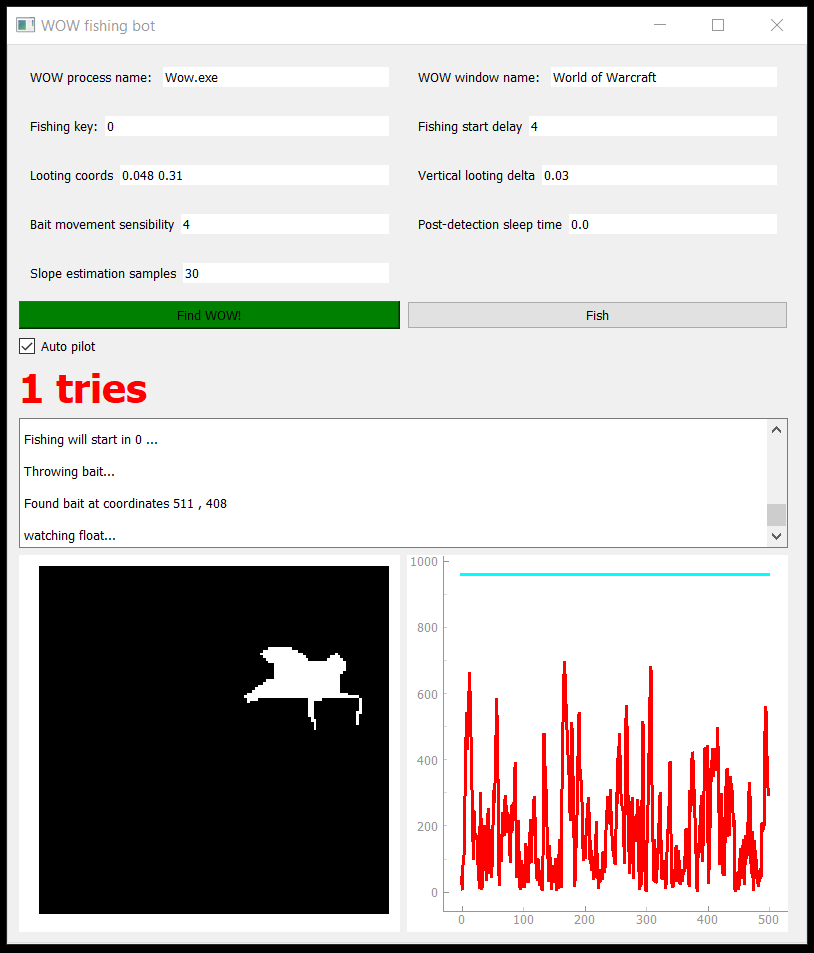

# WOW fishing bot

## Introduction

This program implements a bot using Python that plays the fishing mini-game
within World of Warcraft. It is implemented using Python 3, and uses PyQt5
for its graphical UI, as well as some others that we will discuss later in
this document, and are used for tasks such as OS interaction or image processing.

## Approach

Throughout the process of implementing a working version of this bot (disclaimer, I
am not a master of software engineering nor computer vision or algorithmic problem solving)

I have gone through multiple approaches, before finally settling for one. It is also important
to point out that the problem as a whole can be divided into two smaller sub-problems, that we
will now tackle one by one.


### Phase 1: Throwing the fishing float

First, we throw the fishing float using any library that allows us to create OS
events such as key presses, I use **pyautogui**.

### Phase 2: Finding the fishing float

Secondly, we have to find where the float has landed. This location is random, but tends to be
quite centered on the screen. This task is more or less difficult depending on the characteristics
of the water we are fishing in. In calm waters, using a smoothing gaussian filter plus an edge detector
like **Canny** we may be able to isolate the float, but this will not work if the waters are not calmed
and our algorithm finds extra edges.

I also experimented with **SIFT** and a couple of pictures of fishing floats to be used for feature
extraction. This did not work very well, as the float's shape and overall appearance varies depending
on the angle we are looking at it, as well as the lighting (dynamic in WOW depending on the time of the day)

Overall, I found that a third method was more effective than any computer vision based approach. I
simply use a little information leak that the game suffers: whenever the player's cursor hovers the float,
it changes its icon. We can use Python to check the cursor's icon and a simple grid trajectory on the
screen to iterate until we find the float. Great!


### Phase 3: Watching the float for movement

Now for the second and last phase of our problem. We now have to decide when to click our float. Whenever the
fish takes the bait, the float moves abruptly and some water is splashed for an extra of visual information to
the player. From the beginning I tried to face this problem by separating the float from the water, extracting
a binary mask of the float, and then taking into account the difference between consecutive masks to detect the
key moment.

The final version of my algorithm is a little bit more complex than just this however, and uses 3 distinct
sub-phases:

- Take multiple consecutive masks isolating the float and sum the together to construct an accumulative 
mask that tells us which pixels are more commonly occupied by the float. They will therefore be less interesting
to us!
- Using this accumulative mask, take some more binary masks and compare them with it. For each of them, compute
a score as the sum of element wise division of both masks. This will give us higher number the more different the
new binary masks are from the accumulative mask. We will use these new scores to estimate the normal distribution
of the slope of the temporal series of scores.
- Finally we start watching each frame looking for the moment the fish takes the bait. We will look at slope of the score
of the binary mask for each frame, and trigger a click if its value is considered an outlier with respect to the
distribution of slopes we just computed. In practise this means checking the slope is higher than the mean of scores
plus a certain number of times its standard deviation (we can use 3 times for a 95% confidence interval).


## Requirements

- **pyautogui**: used for clicking and generating key presses
- **numpy**: used for optimized matrix operating and handling
- **win32gui**: used for OS interaction, window handling, etc.
- **mss**: used for efficient and blazzing fast screen capturing.
- **PyQt5**: used for UI creation.
- **keyboard**: used for key press detection to stop fishing.
- **scipy**: used for slope estimation.
- **psutil**: used for checking the WOW process is alive and extracting its info.
- **opencv-python**: used for everything image processing and handling.


## Usage

Create a virtual enviroment (Recommended)

```
python -m venv venv_name
```

Activate it...

In Windows
```
activate ./venv_name/Scripts/activate.bat
```

In Linux
```
source venv_name/bin/activate
```


Install requirements
```
pip install -r requirements.txt
```


Launch it!

```
python bot_grid.py
```


## In-app configuration




There are many tweakable parameters that can be modified through the UI. These paramenters are
important because in challenging fishing conditions you may have to modify them to achieve a better
fishing success rate or even fish anything at all!


- **WOW process name**: The name of the computer process of the game. (can be checked using the task manager)
- **WOW window name**: Name of the WOW window
- **Fishing key**: Key associated inside the game with the fishing command
- **Fishing start delay**: Amount of time (in seconds) to wait from the moment the Fish button is clicked to the
moment the fishing command is issued.
- **Looting coords**: relative looting coords with respect to the height and width of the WOW window, taken from the
top left corner of the window.
- **Vertical looting delta**: Amount of vertical displacement in between different objected to be looted.
There should not be any need to change this really.
- **Bait movement sensibility**: In number of standard deviations. 3 standard deviations account for a 95%
confidence interval. The higher this value the lower the sensibility, that is, the more difficult to consider
a sample as an outlier.
- **Post detection sleep time**: Amount of time, in seconds, to wait once we have detected the fish has taken
the bait until we click on the float. There should not be any need to change this.
- **Slope estimation samples**: Number of score samples in a row to use for the slope estimation that we use
to trigger the clicking event. A higher number will give us a more stable slope (red) signal, but more delay
when triggering a click, so a balance must be found.
- **Autopilot**: Whether if to fish once or do it forever in a loop. This should usually always we ticked.

Once these parameters are tweaked, the user only has to click the **Find WOW!** button and then clicking
**Fish** to start fishing.


Below these two buttons we have the autopilot checkbox, and then a count of the number of tries per execution.
Under the counter we have a log that gives the user general information about the working process of the algorithm,
and finally at the bottom we have to live plots: the first represents the binary mask of the float, while the 
second represents in red the live slope calculation and the blue represents the slope threshold. When the red
line surpasses the blue, we will assume the fish has taken the bait!


